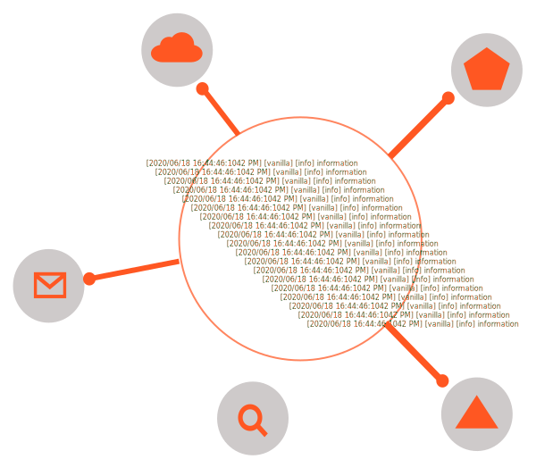

<a style="text-decoration:none" href="https://www.powershellgallery.com/packages/SimplePSLogger" target="_blank" rel="noopener noreferrer">
    <h3 align="center">Simple PowerShell Logging Module</h3>
</a>
<p align="center">
  <a style="text-decoration:none" href="https://www.powershellgallery.com/packages/SimplePSLogger" target="_blank" rel="noopener noreferrer">
    
  </a>
</p>

<p align="center">
  <a style="text-decoration:none" href="https://dev.azure.com/geekwhocodes/simple-ps-logger">
    
  </a>
  <a style="text-decoration:none" href="https://dev.azure.com/geekwhocodes/simple-ps-logger/_test/analytics?definitionId=12&contextType=build">
    
  </a>
  <a style="text-decoration:none" href="https://www.codefactor.io/repository/github/geekwhocodes/simple-ps-logger">
    
  </a>
  
  
  
</p>

---

- [Introduction](#introduction)
    - [Simple powershell module is very extensible and easy use.](#simple-powershell-module-is-very-extensible-and-easy-use)
- [Modules](#modules)
  - [Installation](#installation)
    - [PowerShell Gallery](#powershell-gallery)
    - [Import from Directory](#import-from-directory)
- [Usage](#usage)
      - [Create Logger Instance](#create-logger-instance)
- [Supported Log Levels](#supported-log-levels)
- [Built in Providers](#built-in-providers)
  - [Reporting Issues and Feedback](#reporting-issues-and-feedback)
    - [Issues](#issues)
    - [Feedback](#feedback)


# Introduction

### Simple powershell module is very extensible and easy use. 
- Docs - [SimplePSLogger Documentation](https://spsl.geekwhocodes.me/)
- Task Board - [Board](https://github.com/geekwhocodes/simple-ps-logger/projects/3)
- 
---

# Modules

Below is a table contains our modules including built in provider modules.

| Description                                          | Module Name                     | PowerShell Gallery Link                                   | Downloads                                                                                  |
| ---------------------------------------------------- | ------------------------------- | --------------------------------------------------------- | ------------------------------------------------------------------------------------------ |
| SimplePSLogger                                       | `SimplePSLogger`                | [![SimplePSLogger][SimplePSLoggerImg]][SimplePSLoggerUrl] |  |
| [SimplePSLogger.Console](#Built-in-Providers)        | `SimplePSLogger.Console`        | Sub module                                                |
| [SimplePSLogger.File](#Built-in-Providers)           | `SimplePSLogger.File`           | Sub module                                                |
| [SimplePSLogger.AzLogAnalytics](#Built-in-Providers) | `SimplePSLogger.AzLogAnalytics` | Sub module                                                |

## Installation

### PowerShell Gallery

```powershell
# Install pre-release version 
Install-Module -Name SimplePSLogger -AllowPrerelease

```

### Import from Directory

```powershell
Import-Module -Name drive:path\SimplePSLogger -Verbose
```
Read more about importing module here [Import Module](https://docs.microsoft.com/en-us/powershell/module/microsoft.powershell.core/import-module?view=powershell-7)


<hr/>

# Usage

#### Create Logger Instance

To create new logger instance in your script [New-SimplePSLogger] cmdlet:

```powershell
<#
    .PARAMETER Name 
    This can be used to identify for which purpose you are using this logger instance.
    example - if you are performing task1
    Simple logger will generate log message like this :
    [2020/06/12 15:48:31:2518 PM] [task1] [information]:   "Log from task1"

    here task1 is unique name you used while creating the instance. This will helpful to analyze your logs later. 
    However, you can write your log message in your way by creating custom logging provider. SimplePSLogger will provide :
    Name, Level and Message paramters to your custom logging provider and the you can use them to create your log message.
#>

$MyLogger = New-SimplePSLogger -Name "Unique Name"

<# To log your log message 
    *Log Message type conversion*:
        String - plain text string
        OtherTypes - json serialized string
#>
$MyLogger.Log('level', 'log message')

$MyLogger.Dispose()

```


---

# Supported Log Levels 
| Level       | Description              |
| ----------- | ------------------------ |
| verbose     | for verbose messages     |
| debug       | for debug messages       |
| information | for information messages |
| warning     | for warning messages     |
| error       | for error messages       |
| critical    | for critical messages    |

---

# Built in Providers

| Provider                                                                                            | Description                                | Docs                                                                                            |
| --------------------------------------------------------------------------------------------------- | ------------------------------------------ | ----------------------------------------------------------------------------------------------- |
| Console                                                                                             | Outputs logs to console                    | [Console Provider](https://spsl.geekwhocodes.me/providers/simplepslogger.console)               |
| File                                                                                                | Writes logs to static file                 | [File Provider](https://spsl.geekwhocodes.me/providers/simplepslogger.file)                     |
| [AzLogAnalytics](https://docs.microsoft.com/en-us/azure/azure-monitor/log-query/get-started-portal) | Send logs to Azure Log Analytics Workspace | [AzLogAnalytics Provider](https://spsl.geekwhocodes.me/providers/simplepslogger.azloganalytics) |
| Rolling File                                                                                        | Writes logs to file                        | [To do](https://github.com/geekwhocodes/simple-ps-logger/projects/3#card-40824479)              |


--- 

## Reporting Issues and Feedback

### Issues

If you find any bugs when using this module, Please an issue on github


### Feedback

If there is a feature you would like to see  in SimplePSLogger file an issue on github page. 


[SimplePSLoggerImg]:  https://img.shields.io/powershellgallery/v/SimplePSLogger?include_prereleases&label=SimplePSLogger&style=flat-square
[SimplePSLoggerUrl]:  https://www.powershellgallery.com/packages/SimplePSLogger

[DocsImg]: https://img.shields.io/github/deployments/geekwhocodes/Simple-PS-Logger/github-pages?label=docs&style=flat-square
[DocsUrl]: https://spsl.geekwhocodes.me/

[AzBuildImg]: https://img.shields.io/azure-devops/build/geekwhocodes/simple-ps-logger/12/master?style=flat-square
[AzBuildUrl]: https://dev.azure.com/geekwhocodes/simple-ps-logger

[AzTestsImg]: https://img.shields.io/azure-devops/tests/geekwhocodes/simple-ps-logger/12?style=flat-square
[AzTestsUrl]: https://dev.azure.com/geekwhocodes/simple-ps-logger/_test/analytics?definitionId=12&contextType=build

[CodeFactImg]: https://img.shields.io/codefactor/grade/github/geekwhocodes/simple-ps-logger?style=flat-square
[CodeFactUrl]: https://www.codefactor.io/repository/github/geekwhocodes/simple-ps-logger
